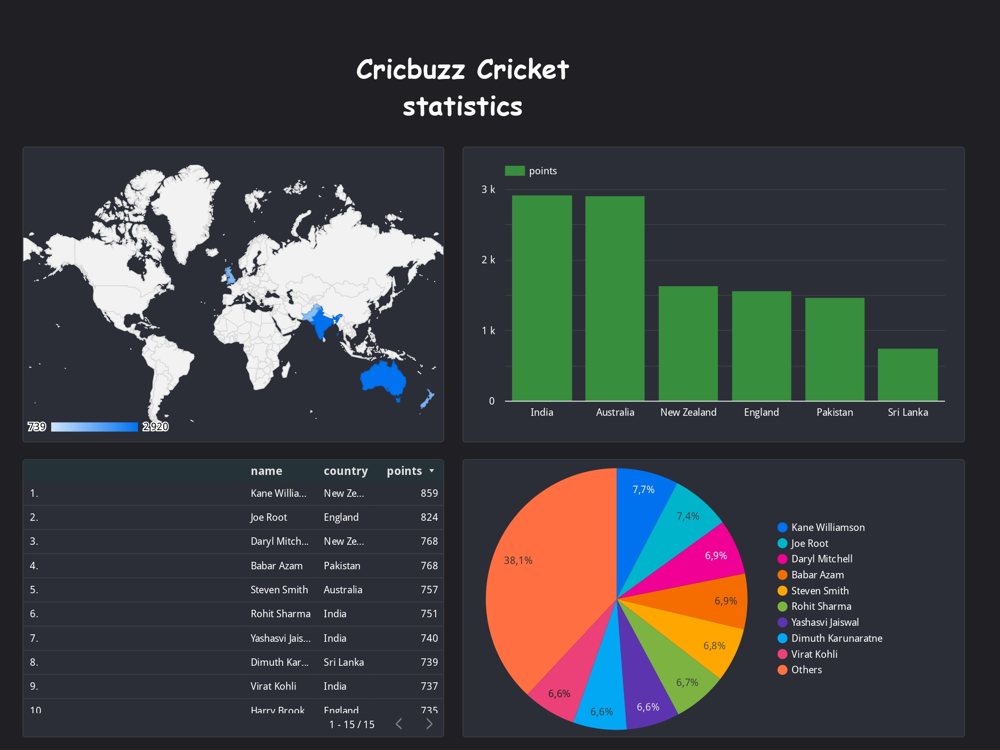

# Data Pipeline and ETL Process

## Project Overview

This project aims to establish a robust data pipeline and ETL process on Google Cloud Platform to automate the extraction, transformation, and loading of cricket ranking data from various APIs into Google BigQuery for analysis and visualization in Looker Studio.

## Architecture Diagram

## Components and Workflow

## Data Extraction

1. **Python Script**: A Python script extracts cricket rankings data from APIs and uploads it directly to Google Cloud Storage (GCS).
2. Airflow on Compute Engine: Airflow is set up on a Google Compute Engine instance to orchestrate and automate the Python script execution based on a predefined schedule.

## Data Processing and ETL

1. **Dataflow**: Utilizes a custom template to process and transform data extracted from GCS, parsing and inserting it into BigQuery.

2. Cloud Functions: An intermediate Cloud Function triggers the Dataflow job automatically whenever new data files are uploaded to GCS.

## Data Storage

1. **BigQuery**: Serves as the centralized data warehouse where transformed data is stored in date-partitioned tables for optimized query performance and cost-efficiency.

## Data Visualization

1. **Looker Studio**: Used for creating interactive dashboards and reports to visualize and analyze processed data.

## DevOps Integration

1. CI/CD Pipeline: Includes integration with Cloud Source Repositories and GitLab for version control, along with Cloud Build for automated builds and deployments.
2. Terraform: Infrastructure as Code (IaC) is used to define and provision all required cloud resources in a repeatable and consistent manner.

## Goals and Functionalities

1. **Automated Data Ingestion**: Scheduled extractions from APIs to GCS.
2. **Real-time Data Processing**: Immediate processing of new data files through Cloud Functions and Dataflow, ensuring data is timely and relevant.
3. **Scalable Storage Solutions**: Use of BigQuery for scalable and efficient data storage.
4. **Seamless DevOps Practices**: Implementation of a CI/CD pipeline to streamline updates and deployments of the pipeline components.
5. **Governance and Best Practices**: Adoption of best practices in cloud resource management and data governance.

